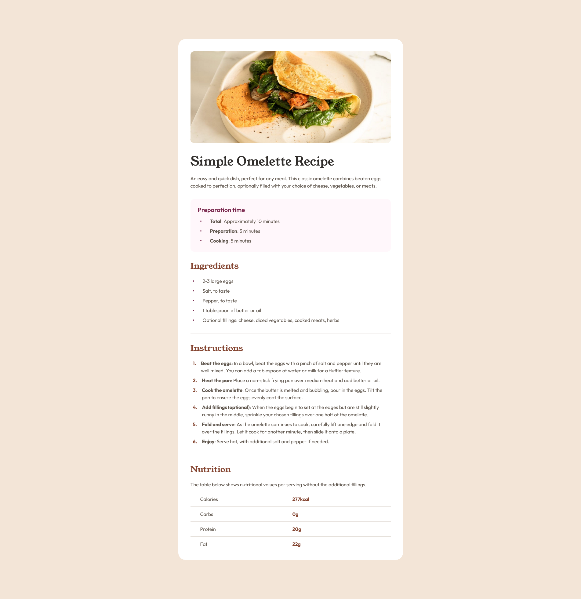

# Frontend Mentor - Recipe page solution

This is a solution to the [Recipe page challenge on Frontend Mentor](https://www.frontendmentor.io/challenges/recipe-page-KiTsR8QQKm). Frontend Mentor challenges help you improve your coding skills by building realistic projects. 

## Table of contents

- [Overview](#overview)
  - [The challenge](#the-challenge)
  - [Screenshot](#screenshot)
  - [Links](#links)
- [My process](#my-process)
  - [Built with](#built-with)
  - [What I learned](#what-i-learned)
  - [Continued development](#continued-development)
  - [Useful resources](#useful-resources)
- [Author](#author)
- [Acknowledgments](#acknowledgments)

## Overview

### Screenshot


### Links
- Solution URL: [View solution on Frontend Mentor](https://www.frontendmentor.io/solutions/)
- Live Site URL: [View live site](https://alexander3717.github.io/RecipePage/)

## My process

### Built with

- Semantic HTML5 markup
- SASS features like nesting, mixin and function
- Flexbox
- Pseudo-element styles
- Mobile-first workflow

### What I learned

Despite this being a simple challenge, I wanted to try SASS for the first time on it because I was curious what's it all about. And I am glad that I decided to do so - now I have the basics down and know what it can be good for. Here are some examples of how I used it in this challenge:

I stored text presets as mixins and later applied them on different selectors with just one line 
```scss
@mixin text-preset-1 {
    color: $color-stone-900;
    font-family: "Young Serif";
    font-size: $font-size-desktop-text-preset-1;
    font-style: normal;
    font-weight: 400;
    line-height: 100%;
}
...
h3 {
    @include text-preset-3;
    color: $color-rose-800;
}
```

Created a function to convert from px to rem easily (using rem instead of px is better for accessibility)

```scss
@function rem($value) {

    @if math.is-unitless($value) {
        @return math.div($value, 16) + rem;
    }

    @else if unit($value) == 'px' {
        @return math.div($value, 1px) / 16 + rem;
    }

    @else {
        @error "The rem() function only accepts unitless numbers or px values. You passed: #{$value}";
    }
}
// example use 
// max-width: rem(616px);

// compiles to max-width: 38.5rem;
```

Took advantage of nesting - instead of writing

```css
.recipe h1 {/*styles here*/}
.recipe h2 {/*styles here*/}
.recipe h3 {/*styles here*/}
```

I wrote

```scss
.recipe {
    h1 {/*styles here*/}
    h2 {/*styles here*/}
    h3 {/*styles here*/}
}
```

Apart from SASS I also learned something about pseudo-elements because they were useful for styling lists on the recipe. For example this is how I managed to customise the unordered list bullets so they look exactly the same as in the design:

```scss
  ul li::before {
        content: "";
        background-color: $color-rose-800;
        height: rem(4px);
        width: rem(4px);
        border-radius: 50%;
        margin-right: calc($spacing-200 - rem(4px));
        flex-shrink: 0;
    }
```
Below I linked to a video explaining pseudo-elements. Basically, they are elements which are present on the page but not marked in HTML.

### Continued development

In future challenges I'd want to explore more SASS features and try some CSS frameworks like Tailwind and Bootstrap to see if they'd be useful for these projects.

### Useful resources

- [SASS documentation](https://sass-lang.com/documentation/)
- [Video explaining pseudo elements](https://www.youtube.com/watch?v=zGiirUiWslI)
- [variables2css plugin](https://www.figma.com/community/plugin/1261234393153346915/variables2css) - With this plugin you can easily export Figma variables to desired code-ready format

## Author

Frontend Mentor - [@Alexander3717](https://www.frontendmentor.io/profile/Alexander3717)
